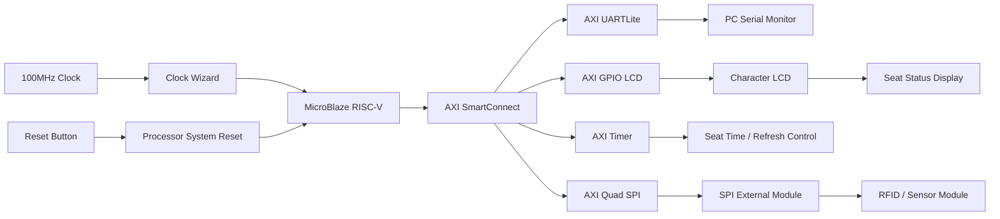
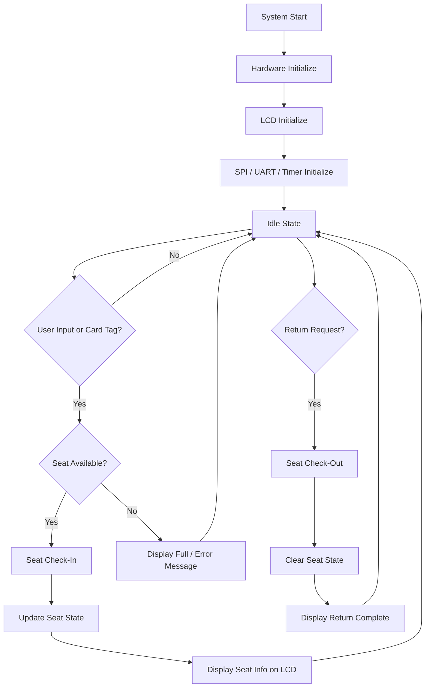

# 📚 Project_5 Library Seat Management 📚
<br>

## 📌 1. Project Summary (프로젝트 요약)

Basys3 FPGA 보드와 Vivado Block Design을 기반으로 구현한 **도서관 좌석 관리 시스템**

---
<br>

## ✨ 2. Key Features (주요 기능)

- RFID 카드를 이용한 좌석 이용 등록 및 반납 기능 구현
- UART와 moserial을 통해 관리자가 좌석 상태를 확인하고 제어할 수 있는 구조 구성
- LCD 화면에 좌석 상태, 안내 문구, 오류 메시지 등을 출력하여 사용자에게 좌석 정보 제공

<br>

## ⚙️ 3. Tech Stack (기술 스택)

### 3.1 Language (사용 언어)

<p>
  
</p>

### 3.2 Development Environment (개발 환경)

<p>
  
  
</p>


<br>

## 🗂️ 4. Project Structure (프로젝트 구조)


```text
project_LIBRARY/
├── project_LIBRARY.xpr                                      # Vivado 프로젝트 파일
├── design_library_wrapper.xsa                               # Vitis 연동용 하드웨어 플랫폼 파일
│
├── project_LIBRARY.srcs/
│   ├── sources_1/
│   │   └── bd/design_library/
│   │       ├── design_library.bd                            # 좌석 관리 시스템 전체 Block Design
│   │       └── ip/                                          # 시스템 동작에 사용되는 주요 IP
│   │           ├── design_library_microblaze_riscv_0_2/     # 전체 좌석 관리 로직을 실행하는 프로세서
│   │           ├── design_library_axi_uartlite_0_3/         # moserial 관리자용 UART 통신
│   │           ├── design_library_axi_gpio_0_2/             # LCD 문자 출력 제어
│   │           ├── design_library_axi_quad_spi_0_2/         # RFID 카드 인식을 위한 SPI 통신
│   │           └── design_library_axi_timer_0_2/            # 시간 기반 동작 처리
│   │
│   └── constrs_1/
│       └── imports/fpga/
│           └── Basys-3-Master.xdc                           # LCD, RFID, UART 등 외부 장치 연결 설정
│
├── project_LIBRARY.gen/
│   └── sources_1/bd/design_library/hdl/
│       └── design_library_wrapper.v                         # Block Design 외부 포트 연결 Wrapper
│
├── project_LIBRARY.runs/
│   ├── synth_1/                                             # 합성 결과
│   └── impl_1/
│       ├── design_library_wrapper.bit                       # Basys3 업로드용 bitstream 파일
│       └── design_library_wrapper.mmi                       # MicroBlaze 메모리 매핑 정보
│
├── project_LIBRARY.hw/                                      # FPGA 보드 연결 및 Hardware Manager 관련 파일
└── project_LIBRARY.sim/                                     # 시뮬레이션 관련 파일
```

<br>

## 🧱 5. System Design (시스템 설계)

### 5.1 Hardware Block Diagram (하드웨어 블록다이어그램)



---

### 5.2 System Flow Chart (동작 흐름도)




###  5.3. I/O Control (입출력 제어)

| Input / Output | Function |
|---|---|
| `sys_clock` | Basys3 100MHz 시스템 클럭 |
| `reset` | 시스템 리셋 입력 |
| `lcd_bus_tri_o[5:0]` | LCD 제어 및 데이터 출력 |
| `spi_rtl_0_ss_io[0]` | SPI Slave Select |
| `spi_rtl_0_sck_io` | SPI Clock |
| `spi_rtl_0_io0_io` | SPI 데이터 신호 |
| `spi_rtl_0_io1_io` | SPI 데이터 신호 |
| `usb_uart_rxd` | UART 수신 |
| `usb_uart_txd` | UART 송신 |


### 5.4. Vivado Block Design (Vivado 블록 디자인)

<br>


<br>


## 🎬 6. Demonstration (시연 영상)

<br><br>

<p>
  <a href="https://www.youtube.com/watch?v=1uI5LCGYi4A">
    
  </a>
</p>

### 이미지를 클릭하면 영상으로 이동합니다

<br><br>

## 🎯 7. Troubleshooting (문제 해결 기록)

### ⚠️ 7.1 RFID UID 불일치 문제

**🔍 문제 상황**

- RFID 카드를 인식했지만, 등록된 카드로 정상 처리되지 않는 문제 발생

**❓ 원인 분석**

- 실제 사용한 RFID 태그의 UID 값이 MFRC522(RC522) RFID 모듈에서 일반적으로 사용하는 예시 UID 값과 달라 일치하지 않았음
  
**❗ 해결 방법**

- Serial Monitor에 출력으로 UID 값을 확인 후 UID 값을 수정

**✅ 결과**

- RFID 태그가 정상적으로 등록 카드로 인식되어 이후 동작이 정상적으로 수행됨

<br>

### ⚠️ 7.2 RFID 카드가 여러 번 인식되는 문제

**🔍 문제 상황**

- RFID 카드를 한 번 태그했는데 입실/퇴실 처리가 여러 번 반복됨

**❓ 원인 분석**

- 단순히 UID가 감지될 때마다 좌석 상태를 변경하면 한 번의 태그가 여러 번의 이벤트로 처리됨

**❗ 해결 방법**

- 카드 인식 후 일정 시간 동안 같은 UID를 무시하는 딜레이 로직 추가

**✅ 결과**

- 한 번의 태그가 한 번의 입실 또는 퇴실 동작으로만 처리됨

<br>

## 🔧 8. Future Improvements (개선 사항)

  * RFID 카드 UID를 사용자 정보와 매칭하여 실제 사용자의 좌석 이용 관리 기능 추가
  * Bluetooth 모듈을 추가하여 모바일 화면에서 좌석 상태 확인
  * 관리자 모드에 전체 좌석 초기화, 강제 반납, 사용 기록 확인 기능 등을 추가


