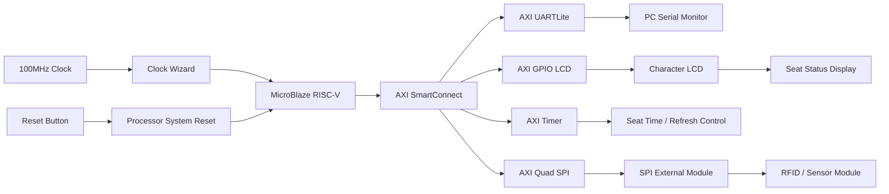
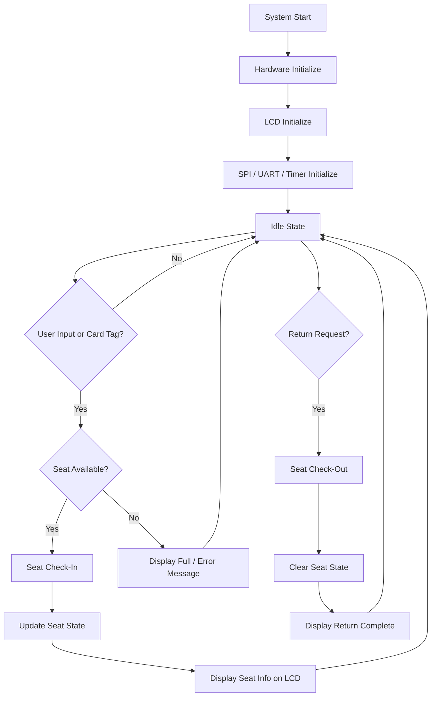

# 📚 Project_5 Library Seat Management 📚
<br>

## 📌 1. Project Summary (프로젝트 요약)

Basys3 FPGA 보드와 Vivado Block Design을 기반으로 구현한 **도서관 좌석 관리 시스템**

---
<br>

## ✨ 2. Key Features (주요 기능)

- RFID 카드를 이용한 좌석 이용 등록 및 반납 기능 구현
- UART와 moserial을 통해 관리자가 좌석 상태를 확인하고 제어할 수 있는 구조 구성
- LCD 화면에 좌석 상태, 안내 문구, 오류 메시지 등을 출력하여 사용자에게 좌석 정보 제공

---

## ⚙️ 3. Tech Stack (기술 스택)

### 3.1 Language / Design

<p>
  
  
  
</p>

### 3.2 Hardware / IP

<p>
  
  


---

## 🗂️ 4. Project Structure (프로젝트 구조)


```text
project_LIBRARY/
├── project_LIBRARY.xpr                                      # Vivado 프로젝트 파일
├── design_library_wrapper.xsa                               # Vitis 연동용 하드웨어 플랫폼 파일
│
├── project_LIBRARY.srcs/
│   ├── sources_1/
│   │   └── bd/design_library/
│   │       ├── design_library.bd                            # 좌석 관리 시스템 전체 Block Design
│   │       └── ip/                                          # 시스템 동작에 사용되는 주요 IP
│   │           ├── design_library_microblaze_riscv_0_2/     # 전체 좌석 관리 로직을 실행하는 프로세서
│   │           ├── design_library_axi_uartlite_0_3/         # moserial 관리자용 UART 통신
│   │           ├── design_library_axi_gpio_0_2/             # LCD 문자 출력 제어
│   │           ├── design_library_axi_quad_spi_0_2/         # RFID 카드 인식을 위한 SPI 통신
│   │           └── design_library_axi_timer_0_2/            # 시간 기반 동작 처리
│   │
│   └── constrs_1/
│       └── imports/fpga/
│           └── Basys-3-Master.xdc                           # LCD, RFID, UART 등 외부 장치 연결 설정
│
├── project_LIBRARY.gen/
│   └── sources_1/bd/design_library/hdl/
│       └── design_library_wrapper.v                         # Block Design 외부 포트 연결 Wrapper
│
├── project_LIBRARY.runs/
│   ├── synth_1/                                             # 합성 결과
│   └── impl_1/
│       ├── design_library_wrapper.bit                       # Basys3 업로드용 bitstream 파일
│       └── design_library_wrapper.mmi                       # MicroBlaze 메모리 매핑 정보
│
├── project_LIBRARY.hw/                                      # FPGA 보드 연결 및 Hardware Manager 관련 파일
└── project_LIBRARY.sim/                                     # 시뮬레이션 관련 파일
```

```

```

---

## 🧱 5. System Design (시스템 설계)

### 5.1 Hardware Block Diagram (하드웨어 블록다이어그램)



---

### 5.2 System Flow Chart (동작 흐름도)




###  5.3. I/O Control (입출력 제어)

| Input / Output | Function |
|---|---|
| `sys_clock` | Basys3 100MHz 시스템 클럭 |
| `reset` | 시스템 리셋 입력 |
| `lcd_bus_tri_o[5:0]` | LCD 제어 및 데이터 출력 |
| `spi_rtl_0_ss_io[0]` | SPI Slave Select |
| `spi_rtl_0_sck_io` | SPI Clock |
| `spi_rtl_0_io0_io` | SPI 데이터 신호 |
| `spi_rtl_0_io1_io` | SPI 데이터 신호 |
| `usb_uart_rxd` | UART 수신 |
| `usb_uart_txd` | UART 송신 |


## 🖼️ 6. Vivado Block Design (Vivado 블록 디자인)

<p>
  
</p>

---

## 🎬 11. Demonstration (시연 영상)

### 이미지를 클릭하면 영상으로 이동합니다

<p>
  <a href="https://www.youtube.com/watch?v=YOUR_VIDEO_ID">
    
  </a>
</p>

---

## 🛠️ 12. Troubleshooting (문제 해결 기록)

### 12.1 LCD 출력 핀 연결 문제

**🔍 문제 상황**

  * LCD에 문자가 출력되지 않거나, 화면에 깨진 문자가 표시되는 문제가 발생했습니다.

**❓ 원인 분석**

  * LCD 제어 신호와 Basys3 보드의 PMOD 핀 연결이 정확히 맞지 않으면 데이터가 정상적으로 전달되지 않습니다.
  * Vivado의 XDC 파일에서 `lcd_bus_tri_o[5:0]` 신호와 실제 LCD 연결 핀을 일치시켜야 했습니다.

**❗ 해결 방법**

  * `Basys-3-Master.xdc` 파일에서 LCD에 사용하는 PMOD 핀만 활성화했습니다.
  * `lcd_bus_tri_o[5:0]` 신호를 JB 포트에 연결하여 LCD 제어 신호가 정상적으로 출력되도록 수정했습니다.

**✅ 결과**

  * LCD에 좌석 상태와 안내 메시지가 정상적으로 출력되었습니다.
  * 하드웨어 핀 연결과 Vivado 제약 조건을 일치시키는 과정의 중요성을 확인했습니다.

---

### 12.2 SPI 외부 모듈 통신 문제

**🔍 문제 상황**

  * SPI 기반 외부 모듈과 통신할 때 데이터가 정상적으로 읽히지 않는 문제가 발생했습니다.

**❓ 원인 분석**

  * SPI 통신은 `SS`, `SCK`, 데이터 입출력 신호가 정확히 연결되어야 합니다.
  * SPI 모드와 클럭 설정이 외부 모듈과 맞지 않으면 데이터 송수신이 실패할 수 있습니다.

**❗ 해결 방법**

  * AXI Quad SPI IP를 추가하고, `spi_rtl_0` 인터페이스를 외부 포트로 연결했습니다.
  * XDC 파일에서 JA 포트에 SPI 신호를 할당했습니다.
  * SPI 모드와 Slave Select 사용 방식을 확인하여 외부 모듈과 통신할 수 있도록 구성했습니다.

**✅ 결과**

  * SPI 외부 장치를 연결할 수 있는 하드웨어 인터페이스가 구성되었습니다.
  * 좌석 관리 시스템에 RFID 또는 센서 모듈을 확장할 수 있는 기반을 마련했습니다.

---

### 12.3 UART 디버깅 연결 문제

**🔍 문제 상황**

  * 시스템 상태를 확인하기 위해 UART 출력을 사용했지만, PC 시리얼 모니터에서 값이 정상적으로 보이지 않는 문제가 발생했습니다.

**❓ 원인 분석**

  * UART 통신은 보드의 RX/TX 핀 설정과 Baud Rate가 맞아야 정상적으로 출력됩니다.
  * AXI UARTLite의 Baud Rate와 PC 시리얼 모니터 설정이 다르면 문자가 깨져 보일 수 있습니다.

**❗ 해결 방법**

  * AXI UARTLite IP를 추가하고 `usb_uart_rxd`, `usb_uart_txd` 포트를 외부로 연결했습니다.
  * Baud Rate를 `115200`으로 설정하고, PC 시리얼 모니터도 동일한 값으로 맞췄습니다.

**✅ 결과**

  * UART를 통해 시스템 상태와 디버깅 메시지를 확인할 수 있게 되었습니다.
  * LCD만으로 확인하기 어려운 내부 동작 상태를 PC에서 확인할 수 있었습니다.

---

### 12.4 Vivado Block Design Address Map 문제

**🔍 문제 상황**

  * MicroBlaze RISC-V에서 주변장치에 접근할 때 일부 IP가 정상적으로 동작하지 않는 문제가 발생할 수 있었습니다.

**❓ 원인 분석**

  * AXI 기반 주변장치는 각각 고유한 주소 영역을 가져야 합니다.
  * 주소가 겹치거나 Address Editor 설정이 누락되면 소프트웨어에서 해당 장치를 정상적으로 제어하기 어렵습니다.

**❗ 해결 방법**

  * Address Editor에서 AXI GPIO, AXI UARTLite, AXI Timer, AXI Quad SPI의 주소 영역을 각각 분리했습니다.
  * 각 IP의 Base Address를 확인하고, Vitis에서 동일한 주소 정보를 사용하도록 XSA 파일을 생성했습니다.

**✅ 결과**

  * MicroBlaze RISC-V에서 각 주변장치에 안정적으로 접근할 수 있는 구조가 완성되었습니다.
  * Vitis에서 하드웨어 플랫폼을 불러와 소프트웨어 제어를 진행할 수 있게 되었습니다.

---

### 12.5 Reset 신호 극성 문제

**🔍 문제 상황**

  * FPGA에 bitstream을 업로드한 후 시스템이 정상적으로 시작되지 않거나, 리셋 후 주변장치가 동작하지 않는 문제가 발생할 수 있었습니다.

**❓ 원인 분석**

  * Processor System Reset IP와 외부 reset 버튼의 극성이 맞지 않으면 MicroBlaze와 AXI 주변장치가 정상적으로 초기화되지 않습니다.
  * reset 신호는 Clock Wizard와 Processor System Reset에 모두 연결되어 있어 전체 시스템 동작에 영향을 줍니다.

**❗ 해결 방법**

  * Vivado Block Design에서 reset 신호를 Processor System Reset과 Clock Wizard에 연결했습니다.
  * XDC 파일에서 reset 입력 핀을 Basys3 버튼에 맞게 설정했습니다.

**✅ 결과**

  * 리셋 입력 후 MicroBlaze와 AXI 주변장치가 안정적으로 초기화되었습니다.
  * 시스템 시작 과정의 불안정한 동작을 줄일 수 있었습니다.

---

## 🚀 13. Future Improvements (개선 사항)

  * RFID 카드 UID를 사용자 정보와 매칭하여 실제 학생별 좌석 이용 관리 기능 추가
  * 좌석별 이용 시간을 저장하고, 장시간 미사용 좌석을 자동 반납 처리하는 기능 추가
  * LCD에 남은 좌석 수, 현재 좌석 번호, 이용 시간 등을 순차적으로 표시
  * UART를 이용해 PC 프로그램과 연동하고, 좌석 현황을 실시간으로 확인
  * Wi-Fi 또는 Bluetooth 모듈을 추가하여 모바일 화면에서 좌석 상태 확인
  * 여러 개의 좌석을 배열 형태로 관리하여 실제 도서관 좌석 배치도처럼 확장
  * 관리자 모드를 추가하여 전체 좌석 초기화, 강제 반납, 사용 기록 확인 기능 추가

---

## 🧾 14. Result (결과)

본 프로젝트는 Basys3 FPGA 보드에서 MicroBlaze RISC-V 기반의 도서관 좌석 관리 시스템을 구현하기 위한 하드웨어 플랫폼을 구성했습니다.

Vivado Block Design을 이용해 MicroBlaze RISC-V, AXI GPIO, AXI UARTLite, AXI Timer, AXI Quad SPI를 연결했으며, LCD 출력과 SPI 외부 모듈 통신, UART 디버깅이 가능한 구조를 완성했습니다.

이를 통해 FPGA 기반 임베디드 시스템 설계, AXI 버스 기반 주변장치 연결, XDC 핀 제약 설정, Vitis 연동용 XSA 생성 흐름을 실습할 수 있었습니다.
